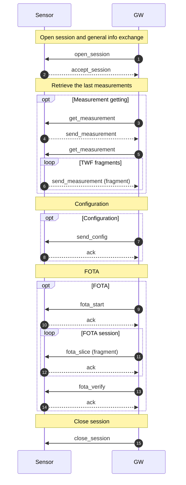
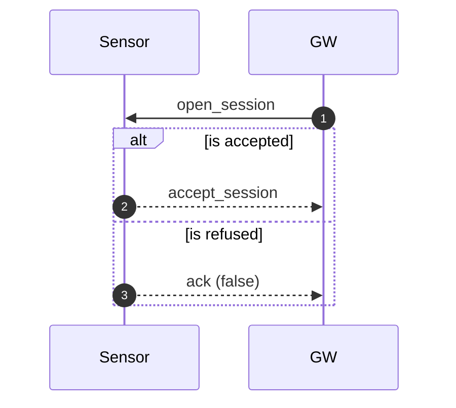
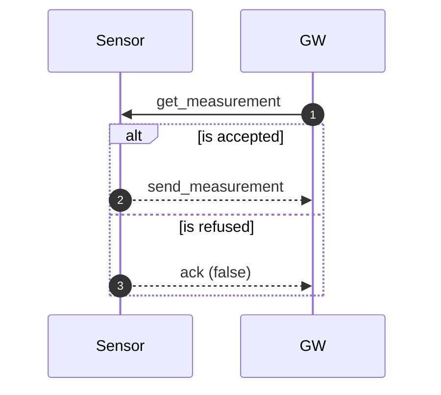
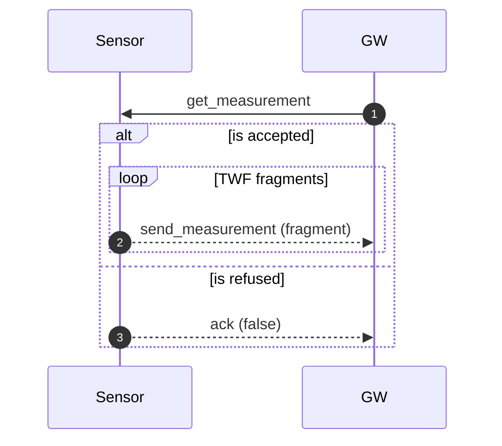
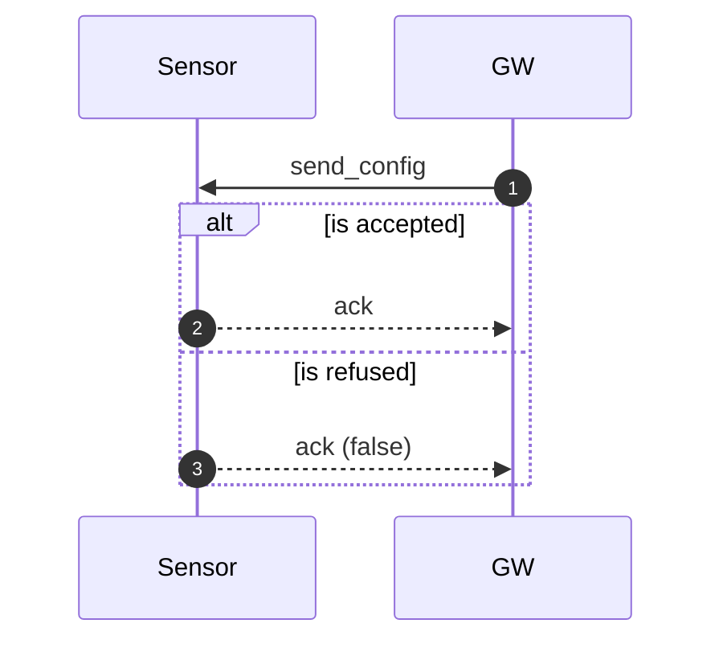
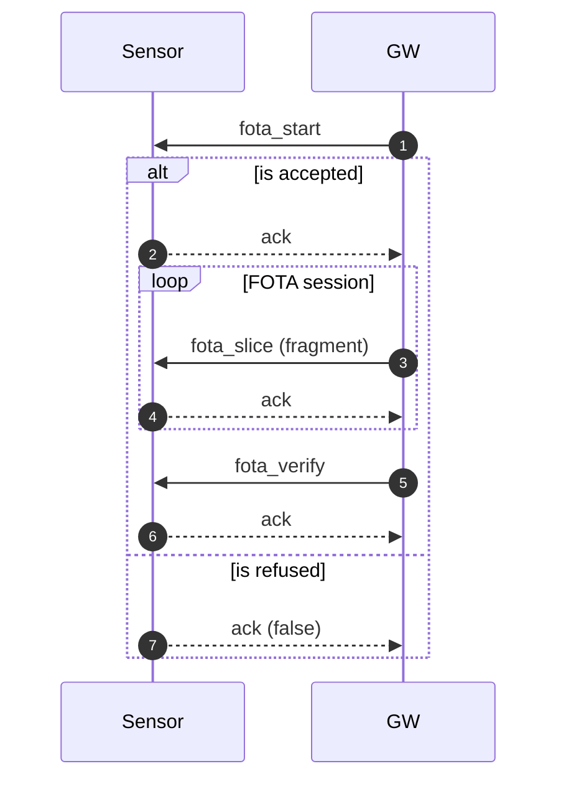
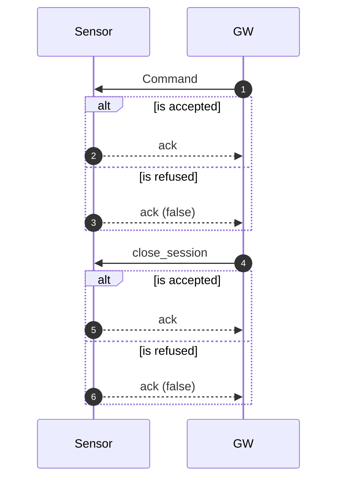

# Objective
The objective of this communication protocol is a lightweight version focused on data exchange size.
This protocol simplifies only the sensor ↔ GW connection, not GW ↔ backend.

# Principle
The protocol aims to preserve current behavior while respecting the frame-size limits of the underlying networks:
|Network Type|Name|Description|Frame size|
|----|----|-----------|----|
|Mesh|Mira|Mira mesh from LumenRadio|160|
|Star|BLE|Bluetooth Low Energy|up to 247|

Because Mira Mesh is UDP-based, messages may be lost. Therefore, every request must receive a response (either an acknowledgement or an error).

A communication session starts with `open_session` and ends with `close_session`. If the session does not end cleanly, the connection is considered lost and the session must be restarted.

Each response must echo the request’s **message_id** so the peer can correlate the response to its request. The GW selects the `message_id` (it can be unique across the network). If a request times out, the GW must send a new request with a different `message_id`. Late responses for an expired `message_id` must be ignored.

Large TWF payloads (often > 8192 bytes) are fragmented across multiple frames. Fragmentation is identified using the header fields **current_fragment** and **total_fragments**. The **current_fragment** is 0-based. This applies only to `data_bytes` (more detail in the relevant chapter).

# Glossary
GW: Gateway
UDP: User Datagram Protocol
TWF: Time wave form
Enveloper3: specific algorithm from SKF

# Exchange GW - Sensor
The exchange will be done in 5 phases:
1. Open session and general info exchange
2. Optional: Retrieve the last measurements
3. Optional: update configuration
4. Optional: FOTA download
5. close session

# Message header
All messages contain a header.
The header is composed of:
|Type|name|Description|Note|
|----|----|-----------|----|
|uint32|version|Protocol version|For future used if needed|
|uint32|message_id|When a request is raised, the answer should also use the same value of `message_id` |On each request this one should change (increase for example) |
|uint32|current_fragment|If the message is fragmented, this field is used to identify the fragment |Note: fragments start at 0. For non-fragmented payloads, set `current_fragment=0`|
|uint32|total_fragments|If the message is fragmented, this field will contain the number of fragments |For non-fragmented payloads, set `total_fragments=0` to explicitly define non fragmented|

# Ack and Error handling

## Ack
Used as the normal response for command-type requests. It always echoes the request `message_id`.
- `ack=true` means the request is accepted and/or completed.
- `ack=false` means the request is refused or failed and **must** include `error_code`.

Fields:
- `ack` (bool)
- `error_code` (uint32, 0 if `ack=true`)
- `error_detail` (bytes, optional; short diagnostic string or code)

## Error
Used only for protocol-level failures (invalid format, unsupported command, invalid state).
It always echoes the request `message_id`.

Fields:
- `error_code` (uint32)
- `error_detail` (bytes, optional)

## Error codes (example)
|Code|Name|Meaning|
|----|----|-------|
|0|OK|No error|
|1|ERR_UNSUPPORTED|Command or feature not supported|
|2|ERR_BAD_FORMAT|Malformed payload or field out of range|
|3|ERR_CRC|CRC/hash mismatch|
|4|ERR_BUSY|Device busy; retry later|
|5|ERR_TIMEOUT|Operation timed out|
|6|ERR_INTERNAL|Internal error|

# Open session and general info exchange

## open_session

The open_session is composed of:
- **Header**: `version=1`, `message_id=123`
- **Body**: `open_session.current_sync_time=1700000000`

|Type|name|Description|Note|
|----|----|-----------|----|
|uint64|current_sync_time|Current time (UNIX time)|used to sync the sensor to official time|

> Sensor must sync its own time with the current time given by the GW. So the time send later by the sensor must be based on the new sync time.

## accept_session

The accept_session is composed of:
- **Header**: `version=1`, `message_id=123`
- **Body**: `virtual_id=424242`
- **Body**: `hardware_type=HardwareTypeCmwa6120_std` Mange Atex and not ATEX
- **Body**: `serial=C4 BD 6A 01 02 03`
- **Body**: `hw_version=2`
- **Body**: `fw_version=0x00010203`
- **Body**: `fw_cache_version=0x00010204`
- **Body**: `config_hash=123456`
- **Body**: `self_diag=0`
- **Body**: `battery_indicator=95`

|Type|name|Description|Note|
|----|----|-----------|----|
|uint32|virtual_id|Virtual Id of the sensor|This is programmed during commissioning|
|HardwareType|hardware_type|HW type|for example: CMWA6120|
|bytes|serial|serial number|for example: C4BD6A010203|
|uint32|hw_version|sensor edition|for example: ed2|
|uint32|fw_version|The firmware version = (Major << 16) + (Minor << 8) + (Bugfix)|for example: 010203 for v1.2.3|
|uint32|fw_cache_version|Firmware version in fota cache|for future use with mesh|
|uint32|config_hash|CRC/hash of the configuration|for future use with config|
|uint32|self_diag|Self diagnostic of the sensor|Needs to be rethought|
|uint32|battery_indicator|Battery level or indicator||

## Ack

see Ack and Error handling chapter

# Retrieve the last measurements
**One response message**

**Fragmented message**

## get_measurement
**One response message**
Overall fits in one message.
- **Header**: `version=1`, `message_id=124`
- **Requests**: `MeasurementTypeAccelerationOverall`
- **Requests**: `MeasurementTypeVelocityOverall`
- **Requests**: `MeasurementTypeEnveloper3Overall`
- **Requests**: `MeasurementTypeTemperatureOverall`

**Fragmented message**
TWF needs to be fragmented.
- **Header**: `version=1`, `message_id=125`
- **Requests**: `MeasurementTypeAccelerationTwf`

## send_measurement
**One response message**
- **Header**: `version=1`, `message_id=124`
- **Global meta**: `send_measurement.global_meta_data.time=1700000000`
- **Measurement 1**: `AccelerationOverall`, `alarm=0`, `duration=1520`, `config_hash=123456`, `peak2peak=5412`, `rms=5413`, `peak=5414`, `std=5415`, `Mean=-5416`
- **Measurement 2**: `VelocityOverall`, `alarm=0`, `duration=1520`, `config_hash=123456`, `peak2peak=5412`, `rms=5413`, `peak=5414`, `std=5415`, `Mean=-5416`
- **Measurement 3**: `Enveloper3Overall`, `alarm=0`, `duration=1520`, `config_hash=123456`, `peak2peak=5412`, `rms=5413`, `peak=5414`, `std=5415`, `Mean=-5416`
- **Measurement 4**: `TemperatureOverall`, `alarm=0`, `duration=1520`, `config_hash=123456`, `uint32_data=12345`

**Fragmented message**
- **Header**: `version=1`, `message_id=125`
- **Fragmentation**: `twf_size=8192`, `chunk_size=192`, `total_fragments=43`
- **Header**: `current_fragment=i`, `total_fragments=43`
- **Global meta**: first fragment only, `send_measurement.global_meta_data.time=1700000000`
- **Metadata**: first fragment only, `vibration_path=MeasurementTypeAccelerationTwf`, `alarm=0`, `duration=1520`, `config_hash=123456`
- **Payload**: `data_bytes` is `192` bytes for all but last fragment; last fragment is `128` bytes

# send Specific fragment

## Ack

see Ack and Error handling chapter

# Configuration

## send_config

The send_config is composed of:
- **Header**: `version=1`, `message_id=130`
- **Body**: `config_bytes=<opaque payload>`

|Type|name|Description|Note|
|----|----|-----------|----|
|bytes|config_bytes|Configuration blob|Format defined by configuration module|

> Note: the configuration payload is not yet defined in proto; keep this as opaque bytes.

## Ack

see Ack and Error handling chapter

# FOTA download

## fota_start

The fota_start is composed of:
- **Header**: `version=1`, `message_id=140`
- **Body**: `image_version=0x00010203`, `image_size=524288`, `image_hash=0xAABBCCDD`

|Type|name|Description|Note|
|----|----|-----------|----|
|uint32|image_version|Firmware version|Same format as `fw_version`|
|uint32|image_size|Total image size (bytes)||
|uint32|image_hash|CRC/hash of image||

## fota_slice

The fota_slice is composed of:
- **Header**: `version=1`, `message_id=141`
- **Header**: `current_fragment=i`, `total_fragments=N`
- **Body**: `slice_bytes=<chunk>`

|Type|name|Description|Note|
|----|----|-----------|----|
|bytes|slice_bytes|Firmware chunk|Fragmented using header fields|

## fota_verify

The fota_verify is composed of:
- **Header**: `version=1`, `message_id=142`
- **Body**: `image_hash=0xAABBCCDD`

|Type|name|Description|Note|
|----|----|-----------|----|
|uint32|image_hash|CRC/hash of image|Must match `fota_start`|

## Ack

see Ack and Error handling chapter

# Close session

## close_session

- **Header**: `version=1`, `message_id=150`
- **Command**: `CommandTypeCloseSession`

## Ack

see Ack and Error handling chapter